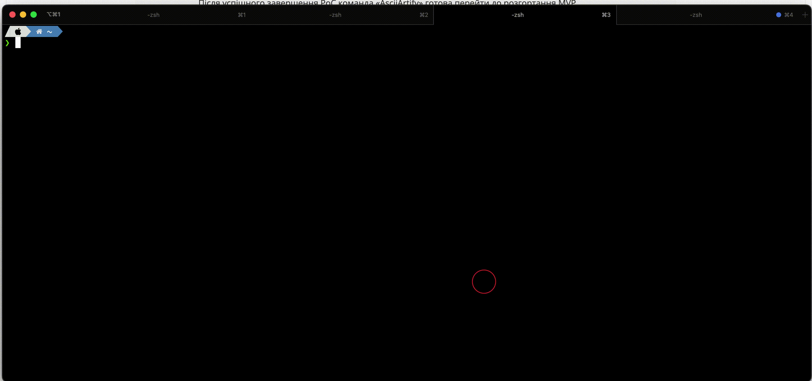

# Minimum Viable Product (MVP) - AsciiArtify GitOps Deployment

Congratulations on reaching the Minimum Viable Product (MVP) stage of the AsciiArtify GitOps deployment! In this phase, we have a basic yet functional deployment of AsciiArtify using GitOps principles with ArgoCD.

## Demo

Here's a brief demonstration of the AsciiArtify MVP:

## Proof of Concept (PoC)

To review the Proof of Concept (PoC) and understand the initial setup, please refer to the [PoC documentation](POC.md).

## Deployed Demo Project

At the end of the PoC, we have successfully deployed a demo project.

## Repository

For more details and the source code, visit [GitHub repository](https://github.com/den-vasyliev/go-demo-app).

Thank you for being a part of the AsciiArtify project!
